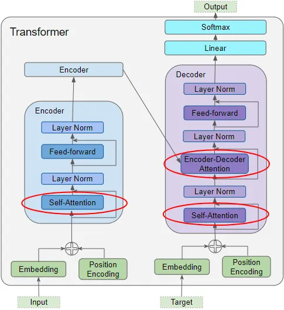

# Exercise 1

This application uses the python `opencv` library to detect and track cars in a video. It also counts how many times cars take a left hand turn at the intersection.

I'm using the `cv2.createBackgroundSubtractorMOG2()` class to perform Background Subtraction.  The BackgroundSubtractor implements the Mixture of Gaussians algorithm, which detects foreground objects by identifying pixels that differ from the background. A mask is returned from the BackgroundSubtractor `apply()` method, and shows a grayscale version of the original image, with the foreground objects highlighted in white.

 The background subtraction is only applied to the bottom half of the frame (Region of Interest).

`cv2.findContours()` finds the contours from the mask. Contours are curves joining all continuous points having the same color or intensity. The function outputs a list of detected contours. Each contour is a numpy array of (x, y) coordinates.

The contours are passed to the `CarTracker` class, responsible for tracking the state of the car across the frames of the video.

To match the current frame's cars with existing cars,`CarTracker.update()` is called for every video frame with the bounding boxes (x,y,w,h) sourced from the contours. The centroid (center point) is calculated for the box, and the Euclidean distance is calculated for the new centroid and the centroid of every existing tracked object. 

I've implemented left turn detection by adding two bounding boxes to the frame at the source and destination of the intersection. On every frame, the tracked object's centroid values are checked to see if their values are inside the bounding boxes. 

A car has successfully completed the turn when the centroid value has entered both of the bounding boxes (across frames).


Currently the project uses distance to associate existing cars with cars in the current frame. A key disadvantage to this approach is the car IDs switch when cars overlap in the frame, making it difficult to maintain consistent tracking. To prevent the ID switching, I've removed part of the frame where this happens from the Region of Interest, but this is not an ideal solution.

There are better, state-of-the-art technologies that track objects based on different features to achieve more reliable tracking:

[YOLO](https://github.com/ultralytics/ultralytics) - This library processes images in real-time using YOLO models. Their models are based on AI, and the results are more accurate than a centroid approach. It provides bounding box coordinates and object classification.

[DeepSort](https://trackers.roboflow.com/develop/trackers/core/deepsort/tracker/) - The detections from YOLO are fed into DeepSORT that combiners motion-based prediction and appearance based matching. It uses a [Kalman filter](https://en.wikipedia.org/wiki/Kalman_filter) to predict the next position of a tracked object, helping it track even if the object is temporarily hidden. It also uses a pre-trained Convolutional Neural Network to extract unique features about the object.

# Exercise 2

This application defines a codec for the lossless data compression method 'Rice coding'. The codec is based on the specification defined at [Michael Dipperstein's Github](https://michaeldipperstein.github.io/rice.html)

It uses the [bitarray](https://pypi.org/project/bitarray/) library to manipulate bits during encoding and decoding.This library provides an object type which efficiently represents an array of booleans. I found this to be more performant compared to bit manipulation using the python stdlib. 

Here is an overview of the application's execution: 

*Source Audio Read*

 - `wavfile.read()` reads the audio file into np.array.

*Linear Prediction Analysis*

The encoder requires residuals as input. The audio source samples are passed to `encode_high_order_predictor()`. This function generates residuals by estimating the current signal sample based on past samples, and then calculates the error in the prediction.

```python

    for n in range(predictor_order, len(signal)):
        # Calculate the predicted sample using the 4th-order formula
        predicted_sample = (4 * signal[n-1] - 6 * signal[n-2] + 4 * signal[n-3] - signal[n-4])
        residuals[n] = signal[n] - predicted_sample
```

The predictor is considered high order, as it estimates the value of a signal using four of its past values, instead of one (linear predictor). 

*Encode Residuals*

 `rice_encode()` iterates on the residuals and performs operations on each value.

First, the value is folded, as rice encoding accepts only unsigned integers.

A bitarray is created to store the encoded bits generated for each sample.

The quotient is calculated for the unsigned sample using bitwise right shift (>> k), then encoded in unary.
The remainder is obtained using a bitwise AND operation with a mask (2^k -1).
Both the quotient and remainder are added to the bitarray.


```python
        q = unsigned_sample >> k
        r = unsigned_sample & ((2 ** k) - 1)

        single_sample_bitarray = bitarray()

        # Unary part (q ones followed by a zero)
        single_sample_bitarray.extend('1' * q)
        single_sample_bitarray.append(0) # Append a single 0 bit

        for bit_pos in range(k - 1, -1, -1):
            single_sample_bitarray.append((r >> bit_pos) & 1)
    
        final_encoded_bitstream.extend(single_sample_bitarray)

```

*Write & Read Encoded Residuals*

The rice encoded residuals are written to a file. The file is named the same as the source audio, suffixed with "_Enc". The file extension is changed from .wav to .ex2.

The bits of the encoded audio file are padded to the nearest whole byte as the operating system can only read and write data in whole byte chunks.

After writing, the encoded residuals are read so they can be validated.

*Decode Rice-Encoded Residuals*

For each sample in the bitarray:
- The quotient value is found by counting the amount of 1 bits before the first 0 bit.
- The remainder is converted to an int by extracing the next k bits from the bitarray.
- Finally, the value is unfolded.

*Linear Prediction Synthesis*

The decoded residuals are added back to a predicted value derived from the previously reconstructed sample. The prediction can be reversed by rearranging the equation that predicts the linear values.

Original Sample (Reconstructed) = Residual + Predicted Sample (from Reconstructed History)

The output of the Linear Prediction Synthesis is written to an audio file and read again using `scipy.io.wavfile`.  The applications refers to this data as `roundtrip_data`, because it has been sent through all components of the application.

*Assertion - Validation*

The last step of the application checks if the source_audio is equal to the `roundtrip_data`. This ensures the codec or predictor does not change the content of the data.

```python
assert np.array_equal(source_audio_data, reconstructed_signal)
```

#### Results

|            | Original Size (bytes) | Rice (K = 4 bits) | Rice (K =2 bits) | %Compression (K=4) | %Compression (K=2) |
| ---------- | --------------------- | ----------------- | ---------------- | ------------------ | ------------------ |
| Sound1.wav | 1002088               | 909958            | 2660076          | 90.8%              | 265%               |
| Sound2.wav | 1008044               | 121228290         | 483936582        | 12026%             | 48007%             |

The results show the K value of the Rice Encoder directly impacting output file size, for both inputs. This is because the quotient value in the encoder is bitwise right shifted by k. As K increases, less bits are stored to represent a sample.


```python
q = unsigned_sample >> k
r = unsigned_sample & ((2 ** k) - 1)
```

The results also show a significant difference between the size of the encoded files for both inputs, even though they were processed with the same Rice Encoding algorithm and K value.

This is because at any K value, a larger amount of bits is required to represent a larger residual value. Therefore, the file size is dependent on the size of the residual value, and the output of the predictor. 

Sound2.wav residuals are larger than Sound1.wav, because Sound1.wav contains spoken word, and Sound2.wav contains drum sounds.

Drum sounds are highly transient, and contain sharp increases in amplitude, which increases the error of the predictor.

```text
Sound1 Residuals: [-7 -7 -7 ... 10 -3 -6]
Sound2 Residuals: [ -999   886 -1325 ...  4567 -5602  6918]
```

The only input and K value that produced an encoded file size smaller than the original was Sound1.wav, K=4.


In summary:
- small residual values decrease quotient bits. 
- large residual values increase quotient bits.
- a small K decreases remainder bits, increases quotient bits.
- a large K increases remainder bits, decreases quotient bits.


Based on the summary above, the encoder could be improved by dynamically deciding the K value relative to the size of the residuals to achieve the optimal compressed file size. A different K parameter could be decided for each individual block of residuals. This is known as Adaptive Rice Encoding, and is used in the FLAC encoder to achieve smaller file sizes.

The codec's performance can be improved by using a language that offers more direct control over hardware and memory, which is crucial for low-level bit manipulation. Python is not ideal for this task because it's a high-level, dynamically-typed language that can only represent a bit as a full sized object in memory.

# Exercise 3

This application is a video analysis and re-encoding tool that checks video files against a predetermined format. If the video file does not meet the expected requirements, the video is encoded. A report is generated for every video, showing what properties did not meet the requirements.

I'm using the ffmpeg-python in this application to encode the video. ffmpeg-python is a python wrapper around ffmpeg. It builds the command line arguments for ffmpeg in python using strings, and uses the `subprocess` module to execute ffmpeg on PATH.  

*Parsing Metadata*

The application uses the `subprocess` module to call ffprobe to gather metadata about the video. 

ffprobe is called with  `--print_format json`, which changes the ffprobe output format to JSON. 

The JSON string is parsed into a python dict using the `json` library, and the application's parsing is applied.

Here is a summary of the parsed video properties:

**Video Format (Container)**

The container holds the compressed video, audio, representing them as streams. It also stores the metadata.

**Video Codec** 

The algorithm used to (de)compress the video data. 

**Audio Codec**

The algorithm used to (de)compress the audio data.

**Frame Rate** 

The amount of images displayed per second. ffprobe outputs this value as a fraction, e.g 25/1 for 25 FPS. The application converts this fraction to a float rounded to 2 decimal places.

```python
def parse_frame_rate(frame_rate):
    if '/' in frame_rate:
        num, den = map(int, frame_rate.split('/'))
        return round(num / den, 2)
```


**Aspect Ratio**

The proportions between the width and height of the video display. ffprobe outputs the aspect ratio in format "WIDTH:HEIGHT" e.g "16:9" or "4:3". 

The application reduces the aspect ratio property to its lowest common divisor using this function:

```python
def parse_aspect(width, height):
    def gcd(a, b):
        while b:
            a, b = b, a % b
        return a
    common_divisor = gcd(width, height)
    return f"{width // common_divisor}:{height // common_divisor}"
```

**Resolution** 

The dimensions of the video frame in pixels, expressed as width x height. 

ffprobe outputs the width and height values as separate properties.

**Video Bit Rate**

The amount of data used per second for the video stream. 

ffprobe outputs this value in bits, and the application stores the desired min and max ranges for this value in bits (2_000_000 <= video bit rate <= 5_000_000).

**Audio Bit Rate**

The amount of data used per second for the audio stream. 

ffprobe also outputs this value in bits, and the desired min value is stored in bits to perform the comparison (audio_bit_rate <= 256000).

**Audio Channels** 

The number of audio channels present in the audio stream (mono, stereo, surround). 

ffprobe outputs an integer specifying the amount of channels. The application parses this value to an int.

*Checks against Requirements*

The ffprobe metadata is used to perform conditional checks against an internal dict containing the desired video properties. The boolean output of the checks are stored in a separate requirements dict.

```python
requirements = dict(
	video_codec=meta["video_codec"] == expected['video_codec'],
	audio_codec=meta["audio_codec"] == expected["audio_codec"],
	frame_rate=meta["frame_rate"] == expected["frame_rate"],
	aspect_ratio=meta["aspect_ratio"] == expected["aspect_ratio"],
	resolution=meta["resolution"] == expected["resolution"],
	video_bit_rate=2_000_000 >= meta["video_bit_rate"] > 5_000_000,
	audio_bit_rate=meta["audio_bit_rate"] < 256000,
	audio_channels=meta["audio_channels"] == 2
)
```

If any boolean items in the requirements list are False, the video is encoded.

*Reports*

The metadata dict is used to generate a report that gets printed to the terminal, showing all video properties that have been parsed, and if the properties meet the criteria:
- If the property matches the criteria, `OK` is shown beside the property.
- If the property does not match the criteria, `FAIL` is displayed, and the desired properties are shown beside it.

```txt
video/Cosmos_War_of_the_Planets.mp4
  · video_codec: h264 OK
  · audio_codec: aac OK
  · frame_rate: 29.97 FAIL, 25
  · aspect_ratio: 314:177 FAIL, 16:9
  · resolution: 628 x 354 FAIL, 640 x 360
  · video_bit_rate: 2989377 OK
  · audio_bit_rate: 317103 OK
  · audio_channels: 2 OK
```

*Encoding*

The video is encoded if the video properties do not meet the requirements defined.

The main function that encodes the video is `ffmpeg.output()`

A dict is created to store the parameters to execute `ffmpeg.output()` with. The values from the metadata dict are mapped onto it. 

Some parameters require additional formatting. For example, ffmpeg requires the`k` suffix to denote kilobytes. 

A new stream is created using `ffmpeg.input(video_input_path)` and a scaling filter is added to the video stream to scale the video to the desired resolution.

The output video is written to the same directory as the input video, with `_formatOK.mp4` appended to the filename.

```python
    args = dict(
        vcodec=params["video_codec"],
        acodec=params["audio_codec"],
        r=params["frame_rate"],
        aspect=params['aspect_ratio'],
        # ffmpeg-python expects 'k' suffix for kilobits
        video_bitrate = f"{params['video_bit_rate']['max']}k",
        audio_bitrate = f"{params['audio_bit_rate']['max']}k",
        ac=params['audio_channels']

    )
    stream = ffmpeg.input(input_path)

    res_parts = str(params['resolution']).split('x')
    width = res_parts[0].strip()
    height = res_parts[1].strip()

    stream = stream.video.filter('scale', width=width, height=height)

    combined_stream = ffmpeg.concat(stream, ffmpeg.input(input_path).audio, v=1, a=1)

    output_path = input_path.parent / Path(str(input_path.stem) + "_formatOK.mp4")

    (
        combined_stream
        .output(str(output_path), **args)
        .run(overwrite_output=True)
    )

```

# Exercise 4

Over the past decade, computer vision and audio processing have undergone a transformation, moving beyond simple tasks like object detection and classification. Primarily due to advancement in Deep Learning, the field of computer vision has evolved to produce applications that are suited for a wide range of practical, everyday tasks.

This chapter explores and provides technical explanations of three emerging computer vision applications.

### Explainable AI (XAI) - Review

[Explainable AI (XAI)](https://en.wikipedia.org/wiki/Explainable_artificial_intelligence) is a field of research that explores methods that provide humans with the ability of intellectual oversight over AI algorithms. XAI hopes to help users of AI-powered systems perform more effectively by improving their understanding of how those systems reason.

The decision making process of a neural network is often opaque, making it difficult for humans to trace the reason behind a classification or an object detection.

XAI resolves this by providing a human understandable explanation (prediction) of how a black box model, like a deep neural network, arrives at its decisions.

**XAI is used creatively to address real-life problems** to display other information alongside the prediction to the user:
- In healthcare, a model might identify a tumour in an X-ray. An XAI heatmap can show a clinician where the model saw the tumor.
- For self-driving cars, if a car's vision system fails to detect a pedestrian, XAI can be used to analyze the failure and show the object the vision system was focusing on instead.*

### Technical Discussion on XAI

*Grad-CAM (Gradient-weighted Class Activation Mapping*

[Grad-CAM](https://christophm.github.io/interpretable-ml-book/pixel-attribution.html#grad-cam)  (Gradient-weighted Class Activation Mapping) is a widely adopted method that explains the output of Convolution Neural Networks (CNNs).  

The goal of Grad-CAM is to understand which parts of an image a convolutional layer looks at for a classification.  Grad-CAM understands this by analyzing which regions are activated in the feature maps of the last convolutional layers of the CNN.

The first convolutional layer of a CNN takes as input the images, and outputs feature maps that encode learned features.
The higher-level convolutional layers do the same, but take as input the feature maps of the previous convolutional layers.

It also uses a measure of "gradient" - the score for a specific target class (c) with respect to the activations of each feature map (k) in that last convolutional layer. The gradients for each feature map are globally averaged to produce a single weight for the entire feature map. This gives a heatmap which highlights regions that positively affect the class of interest. Negative values are removed using a ReLU function, and the heatmap is mapped back to the original image's scaling so it can be overlaid.

### Vision-based Human-Computer Interaction (HCI) - Review

[HCI](https://en.wikipedia.org/wiki/Human%E2%80%93computer_interaction) is the process through which people operate and engage with computer systems. This field uses computer vision as a way for humans to interact with technology without relying on traditional input devices.

In Augmented Reality and Virtual Reality, it enables precise and responsive hand and body tracking.
It allows for interactions in specific environments, such as a surgeon interacting with medical images using hand gestures.
In vehicles, it can monitor a driver's head movement to detect signs of drowsiness.

As AI has emerged, HCI has become a modern, major topic. HCI principles can be used to design interfaces that allow users to interact and correct the AI's explanations, giving control over the system. XAI provides the "what" (the explanation), and HCI provides the "how" (the design of the interface and interaction to make that explanation useful).

### Multimodal AI Systems - Review

Computer vision has been integral to robotics for tasks like navigation and object detection for a long time. 

Multimodal AI systems are designed to process and understand information from multiple sources at the same time. This mirrors how humans perceive the world. Input from cameras, microphones, sensors, and natural language can be received and process to provide contextual awareness.

This technology is moving robots beyond controlled environments into public-facing roles in public areas.

**Multimodal AI Systems are being used creatively to address real-life problems**:
- Tesla develops and uses a multimodal system for their electric cars. The input to the system consists of high resolution cameras, ultrasonic sensors and a network of real-world driving data. 
- Google Health and Deepmind have developed a multimodal AI model [Med-PaLM M](https://sites.research.google/med-palm/), designed to interpret a wide array of medical data. 
#### Technical Discussion of Multimodal AI Systems

[There are five technical challenges surrounding multimodal machine learning](https://people.ict.usc.edu/~gratch/CSCI534/Readings/Baltrusaitis-MMML-survey.pdf) that are central to progressing in the field:

**Representation** - how to represent the data. The heterogeneity of multimodal data makes it challenging to construct representations that fit the learning. 
**Translation** - how to map data from one modality to another. The relationship between modalities is often open ended or subjective. 
**Alignment** - identifying the direct relations between elements from 2 or more different modalities.
**Fusion** - joins information from 2 or more modalities to perform a prediction.
**Co-Learning** - transferring knowledge between modalities

This technical discussion explains the challenges of Representation.

*Sequential Representation*

Sequential Representation is used as a technique to represent the data to the Multimodal AI system.
Currently, the state-of-the-art technique for sequential representation is based on the Transformer architecture.
The Transform Architecture is a neural network architecture that has changed how models process sequential text, video, and audio. The model weighs the importance of difference parts of the sequence simultaneously, unlike older models like Recurrent Neural Network that process data one step at a time.
The Self-Attention Layer and the Feed-Forward Network Layer are the two main sub-layers that make up a single Transformer Layer.



The Self-Attention layer enables the model to determine the relationship between each element in a sequence, and generates a Query, Key, and Value. It calculates and outputs an attention score by comparing the query of one element to the keys of all other elements. The scores are used to create a weighed sum of the value vectors, which become the output for that element.

The Feed-Forward Network adds non-linearity and refines the element.

#### Exercise 4 - References
[Multimodal Machine Learning: A Survey and Taxonomy](https://people.ict.usc.edu/~gratch/CSCI534/Readings/Baltrusaitis-MMML-survey.pdf)
[Multimodal Learning - Wikipedia](https://en.wikipedia.org/wiki/Multimodal_learning)
[A Deep Dive into Transformers Architecture - Henrique Krupck Secchi Medium](https://medium.com/@krupck/a-deep-dive-into-transformers-architecture-58fed326b08d)
[Molnar, C. (2022). Interpretable Machine Learning: A Guide for Making Black Box Models Explainable](https://christophm.github.io/interpretable-ml-book/)
[Google Research - Med-PaLM](https://sites.research.google/med-palm/)
